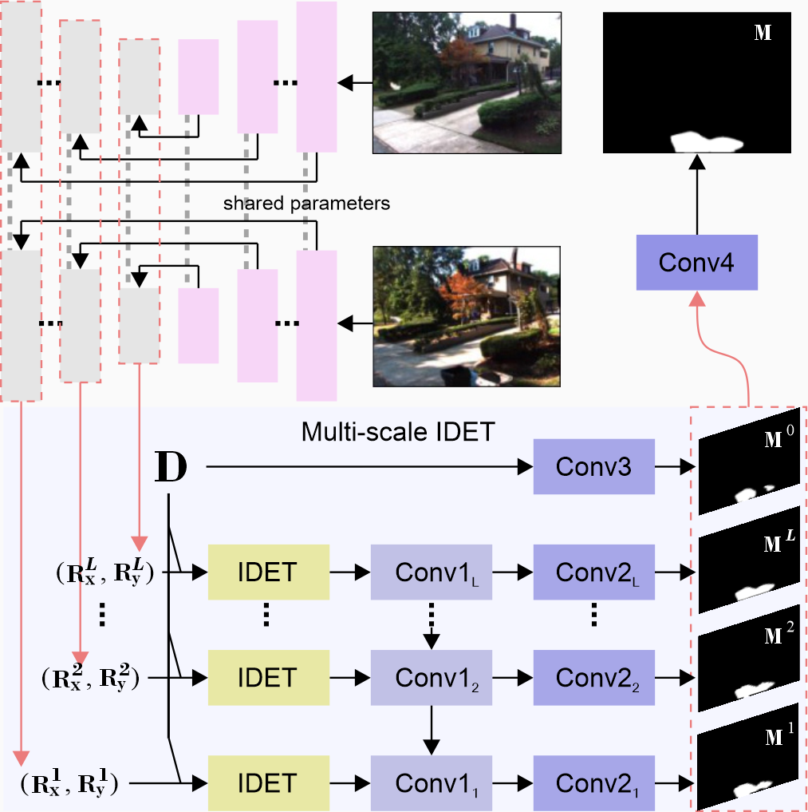
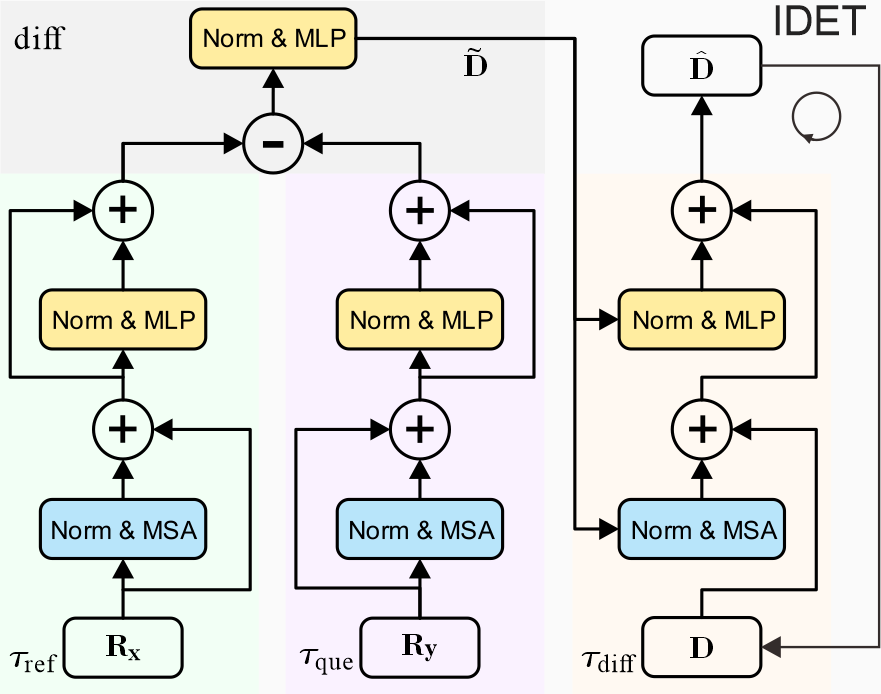

[](https://raw.githubusercontent.com/nvlabs/SPADE/master/LICENSE.md)

# IDET: Iterative Difference-Enhanced Transformers for High-Quality Change Detection
This repo presents [IDET](https://arxiv.org/pdf/2207.09240), an iterative Difference-Enhanced Transformer block for change detection. 
It consists of three Transformers, where the first two transformers are used to enhance the reference and query features and the last to strengthen the difference features between them. 
The core of the model, the *iterative Difference-Enhanced Transformers* (IDET) block, 
makes sure that the network can generate high-quality difference features.

<table frame=void>	
	<tr>		   <!--<tr>一行的内容<\tr>，<td>一个格子的内容<\td>-->
    <td><center>
        <br>"IDET Framework."
        </center></td>	
    <td><center><br>"IDET Architecture."</center></td>
    </tr>
</table>


### Setup

Python 3 dependencies:

* Pytorch 1.4.0

* torchvision 0.5.0

* numpy

* matplotlib

  

---
## CD Datasets

We conduct various experiments on six widely used change detection datasets, which can be divided into two types, street views CD datasets and remote sensing scenes CD datasets. Our data structure as follows:

```
|-- data_CMU 
|----|- train            # training dataset
|        |- image.txt    # reference image path
|        |- image2.txt   # query image path
|        |- label.txt    # ground truth path
|----|-test              # testing dataset
|        |- image.txt
|        |- image2.txt
|        |- label.txt
.
```

## Street views datasets:
- [VL-CMU-CD: A street-view change detection dataset.](https://link.springer.com/article/10.1007/s10514-018-9734-5)
- [PCD:  Tsunami destroyed views (Tsunami) and Google Street Views (GSV) dataset.](http://www.vision.is.tohoku.ac.jp/files/9814/3947/4830/71-Sakurada-BMVC15.pdf) 
- [CDnet2014: Frame-based change detection benchmark dataset.](http://changedetection.net/)

## Remote sensing datasets:
- [LEVIR-CD: Buildings change detection dataset.](https://www.mdpi.com/2072-4292/12/10/1662)
- [CDD:  Aerial and Satellite imagery change detection dataset.](https://ieeexplore.ieee.org/document/8444434) 
- [AICD: Aerial image change detection dataset.](https://hal.archives-ouvertes.fr/hal-00667237/document)

## Labels

We all use the binary change maps to supervise the training of IDET. 

---
# Acknowledgments

Parts of the code were based on [Segformer](https://github.com/NVlabs/SegFormer). Thanks for their excellent work!

## Cite


```
@misc{https://doi.org/10.48550/arxiv.2207.09240,
  doi = {10.48550/ARXIV.2207.09240},
  url = {https://arxiv.org/abs/2207.09240},
  author = {Guo, Qing and Wang, Ruofei and Huang, Rui and Sun, Shuifa and Zhang, Yuxiang},
  keywords = {Computer Vision and Pattern Recognition (cs.CV), FOS: Computer and information sciences, FOS: Computer and information sciences},
  title = {IDET: Iterative Difference-Enhanced Transformers for High-Quality Change Detection},
  publisher = {arXiv},
  year = {2022},
  copyright = {arXiv.org perpetual, non-exclusive license}
}
```
